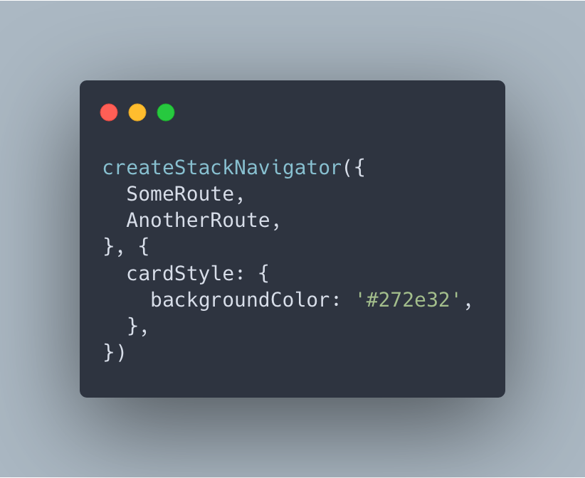
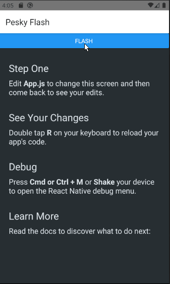
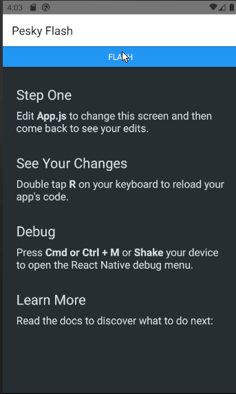
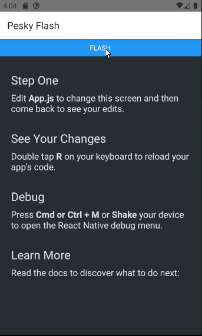

# Remove that pesky white-navigation-flash!
Hey! It's you from the future! You had a React Native project up and running with React Navigation and it was great! But now, a couple of weeks later, something doesn't feel that great anymore. Something is tingling in your spider senses, and that's when you notice it. Every time that you navigate in your app, the screen flashes. Like lightning stuck inside your screen. You hate it. You haven't noticed that pesky flash in your other amazing apps. What did you do wrong this time?

Fret not! You from the past are here to make your day a little bit better, and a little bit cooler. All it will take to fix this nasty little flash is something called Card Style, or cardStyle in the world of props! 

Card style is super nicely documented and you can read more about it here. It's simply stated in the documentation that "Use this prop to override or extend the default style for an individual card in stack", which doesn't really explain why this is your savior. 

I believe that the card is located behind the screen that is being navigated to, and that is why you get that pesky flash. So if you simply change the background color of the Card Style to the background color of your next screen. Doing so will make the white flash magically convert into another color.

# Let there be code!
You can change the Card Style by doing adding the following to your navigator. Basically telling the configuration that you would like the underlying card to be of the specific color "#272e32" which should make it pretty dark. One might think that you could go with “transparent” if there’s no specific color available for you to choose, however, that will not make the flash go away.

This will result in a nicer transition without a white flash, and that will look something like this. If you compare the old transition with the new, you can see that the transition has become much better. It's supreme, amazing, and delicious (It’s not really that big of a deal, but it looks much better).

| White | Red | #272e32 |
|-------|-----|---------|
||||

That’s it! You now have the power to convert your trainwreck transitions into something much nicer.
