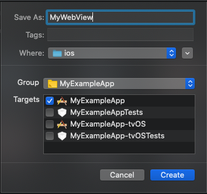

# Introduction

React Native is great in many ways, primarily for offering a way to build apps for both iOS and Android using the same codebase while offering plenty of tools and functionality for both platforms. However, there are rare cases where you might need some functionality that is only available through a specific platform's API. To access such functionality you need to write native modules using either Swift+Objective-C for iOS, or Java/Kotlin for Android, and bridge them over to React Native.  
React Native's documentation on how to do this is in all honesty somewhat lacking at times, and at best it's pretty scattered, so a React Native developer who is new to working with native modules might find themselves spending hours piecing together bits of information from a multitude of different articles and blog posts to get even the simplest of native module to work.  

This post will focus on the iOS side since information on how to do this was especially difficult to find compared to Android. This guide covers how to bridge a native iOS WebView written in Swift for usage in React Native, and also how to pass data between them. While the example used in the guide will focus on how to bridge a WebView, the same principle can be used for virtually any UIView in Swift.

# Getting started

We will start by creating a very simple WebView in Swift and display it in React Native. In later steps, we will make the WebView communicate back and forth with React Native.  

## Xcode  

### Create Swift file

- Begin by opening your React Native project in Xcode.   

- Directly in your iOS project create a new Swift file.
    - To do this right-click your project folder and select **New File...**
    - Select **Swift File**, then **Next**.
    - Choose a fitting name for your file. Since we're making a custom native WebView we'll just name it **MyWebView**. Make sure the file will be saved in the **ios** folder. Also, make sure the project folder is selected in **Group**. Select your project target.  



### Configure Objective-C bridging header

If this was the first Swift file created in the project a pop-up should appear asking if you would like to configure an Objective-C bridging header. This is needed to mix Objective-C and Swift code in the project, which we need to do in order to bridge Swift code to React Native, so go ahead and select **Create Bridging Header**.   
The file will be a header file named "**[ProjectName]**-Bridging-Header.h". If you do not get the prompt and are sure you have not created one before, you can create one manually by right-clicking your project folder and selecting **New File...**, then **Header File**. Name it "**[ProjectName]**-Bridging-Header.h".    

Go to the **Build Settings** tab for your project, search for **Swift Compiler - General**, and make sure your bridging header is set as the **Objective-C Bridging Header** setting. Xcode should update this setting automatically if you chose let Xcode configure the bridging header when prompted. If it was done manually, this setting must also be updated manually.    

*Note: A header file is used to define information that will be needed across multiple files, containing class/function declarations, etc.*  

Using this file we can specify which Objective-C files should be exposed to Swift, so they can be imported and used in our Swift code.   
To do this simply add the import statement of the Objective-C file you want to use in Swift, as below:   
```h
// [ProjectName]-Bridging-Header.h
#import <React/RCTBridgeModule.h>
#import <React/RCTViewManager.h>
```

*Note: "RCT" stands for React, so whenever you see "RCT" in Objective-C or Swift it is most likely related to React Native.*

## Swift

Open the Swift file you created in the previous step and add the following class to it:  

```swift
// MyWebView.swift
import Foundation
import WebKit
import UIKit

@objc(MyWebViewManager)
class MyWebViewManager: RCTViewManager {
    override static func requiresMainQueueSetup() -> Bool {
        return true
    }

    override func view() -> UIView! {
        let mainView = MyWebView(frame: CGRect(
            origin: CGPoint(x: 0, y: 0),
            size: UIScreen.main.bounds.size
        ))
        return mainView
    }
}
```

- The class is created with the `@objc` attribute to specify that it will be exposed and usable in Objective-C code. This can also be used to expose methods and variables, which we'll get to later on in the guide.  
- Notice that the class inherits from `RCTViewManager`, which comes from the Objective-C file we bridged in "[ProjectName]-Bridging-Header.h".
- The class overrides the method `requiresMainQueueSetup()`, and returns `true`. This is to make the code run on the main thread, which in this case is needed since only the main thread can make use of the `UIKit` framework. React Native defaults initialization of native modules/components to a background thread unless explicitly stated otherwise.
- Finally, the `view()` method instantiates the view that is managed by the module. The method is overridden to specify what the view should show.  

The `view()` method can return virtually any Swift UI Component. In this case, it's our custom WebView. Let's add the code for the WebView now. It can be placed in the same file as the ViewManager:  


```swift
// MyWebView.swift

...

@objc(MyWebView)
public class MyWebView: UIView, WKNavigationDelegate, WKUIDelegate {
    var webView: WKWebView!
    var webViewURL: NSString = "https://beanloop.se"

    public override init(frame: CGRect) {
        super.init(frame: frame)

        let configuration: WKWebViewConfiguration = WKWebViewConfiguration()
        webView = WKWebView(frame: frame, configuration: configuration)
        if let url = URL(string: webViewURL as! String) {
            webView.load(URLRequest(url: url))
            webView.allowsBackForwardNavigationGestures = true
        }

        addSubview(webView) // `addSubview` method from the UIView class
    }

    public required init?(coder aDecoder: NSCoder) {
        fatalError("init(coder:) has not been implemented")
    }
}
```

## Bridge to React Native with Objective-C

To bridge the WebView to React Native we need to use Objective-C as an intermediary. This is where the `@objc` attributes will come in handy.   

- Directly in your iOS project create a new Objective-C file.
    - Right-click your project folder and select **New File...**
    - Select **Objective-C File**, then **Next**.
    - Name it the same as the Swift file, in our case **MyWebView**. Make sure the file will be saved in the **ios** folder. Also, make sure the project folder is selected in **Group**. Select your project target.

*Note: In Objective-C, files with the extension `.h` are header files, used for public declarations of the class. Files with the extension `.m` are implementation files, which contain the private implementation of the class.*

```m
// MyWebView.m
#import <Foundation/Foundation.h>
#import <React/RCTBridgeModule.h>
#import <React/RCTViewManager.h>

@interface RCT_EXTERN_MODULE(MyWebViewManager, RCTViewManager)
@end
```

That is all we need to bridge our very simple native WebView to React Native. Now, let's switch to our React Native code to try it out!

## React Native

```js
import React from "react"
import { View, requireNativeComponent, NativeModules } from "react-native"
import { WebView } from "react-native-webview"

const MyWebView = requireNativeComponent("MyWebView")
const { MyWebViewManager } = NativeModules

const MyRNWebView = () => {
    return (
        <View style={{ flex: 1 }}>
            <WebView
                nativeConfig={{
                    component: MyWebView,
                    viewManager: MyWebViewManager,
                }}
            />
        </View>
    )
}
```

Here we use the regular `WebView` component from `react-native-webview` but we pass our own native components as the `component` & `viewManager` in the `nativeConfig`, as per [React Native's docs](https://facebook.github.io/react-native/docs/webview#nativeconfig).


# Communication between React Native and Swift

So far we have made our native WebView in Swift and we've managed to bridge it to React Native and render it. Great! But at this stage, it's rather limited in its usage. It can only view a single predefined URL, and it can't return any data back to the React Native side either.  

We can fix this by letting the WebView accept props from React Native and set up events from the WebView that React Native can intercept!

## Passing data to Swift class as props

While staying on the React Native side, let's add the property `props` to our WebView's `nativeConfig`, containing the URL:

```js
<WebView
    nativeConfig={{
        component: MyWebView,
        props: {
            webViewURL: "https://beanloop.se",
        },
        viewManager: MyWebViewManager,
    }}
/>
```

We then need to update our **MyWebView.m** file to expose the WebView's `webViewURL` property:

*Important note: The same name for the Swift class' property must also be used for the prop, in this case, `webViewURL`.*

```m
// MyWebView.m
#import <Foundation/Foundation.h>
#import <React/RCTBridgeModule.h>
#import <React/RCTViewManager.h>

@interface RCT_EXTERN_MODULE(MyWebViewManager, RCTViewManager)

RCT_EXPORT_VIEW_PROPERTY(webViewURL, NSString)

@end
```

Finally, in our Swift class, we need to intercept the prop and handle it accordingly. Leave the Manager class alone but update the `MyWebView` class:

```swift
// MyWebView.swift

...

@objc(MyWebView)
public class MyWebView: UIView, WKNavigationDelegate, WKUIDelegate {
    var webView: WKWebView!
    var webViewURL: NSString? // this property needs to have the same name as the React Native prop

    @objc func setWebViewURL(_ val: NSString) {
        webViewURL = val
        
        // This code was previously in the `init` method
        if let url = URL(string: webViewURL as! String) {
            webView.load(URLRequest(url: url))
            webView.allowsBackForwardNavigationGestures = true
        }

        addSubview(webView) // `addSubview` method from the UIView class
    }

    public override init(frame: CGRect) {
        super.init(frame: frame)

        let configuration: WKWebViewConfiguration = WKWebViewConfiguration()
        webView = WKWebView(frame: frame, configuration: configuration)
    }

    public required init?(coder aDecoder: NSCoder) {
        fatalError("init(coder:) has not been implemented")
    }
}
```

This moves the code that loads the URL from `init()` to the `setWebViewURL()` method which is automatically called when the `webViewURL` prop is set. This is because at the time when `init()` is run the value from the prop hasn't been set yet.

Try running the updated code and it should still work while passing the URL as a prop from React Native!

## Passing data back from Swift class to React Native

The final step of this guide will be to pass data from Swift back to React Native. For this example whenever the WebView redirects, it will pass the URL to React Native. To do this we need to make use of events.  

In our Swift class again: 

```swift
// MyWebView.swift

...

@objc(MyWebView)
public class MyWebView: UIView, WKNavigationDelegate, WKUIDelegate {
    ...

    @objc var onRedirect: RCTDirectEventBlock? // Add

    ...

    // Add
    public func webView(_ webView: WKWebView, decidePolicyFor navigationAction: WKNavigationAction, decisionHandler: (WKNavigationActionPolicy) -> Void) {
      onRedirect!(["url": navigationAction.request.url?.absoluteString ?? ""])
      decisionHandler(.allow)
    }
}
```

- We add another property to the `MyWebView` class, this time `onRedirect()`, which is of type `RCTDirectEventBlock`.  
- Then we implement the `webView` method that decides the policy for navigation actions, e.g. redirects. In this case, we simply allow every redirect to trigger the `onRedirect()` event to send the URL back to React Native.  

We need to update our Objective-C **MyWebView.m** file to expose the new property, same as before:

```m
// MyWebView.m
#import <Foundation/Foundation.h>
#import <React/RCTBridgeModule.h>
#import <React/RCTViewManager.h>

@interface RCT_EXTERN_MODULE(MyWebViewManager, RCTViewManager)

RCT_EXPORT_VIEW_PROPERTY(webViewURL, NSString)
RCT_EXPORT_VIEW_PROPERTY(onRedirect, RCTDirectEventBlock)

@end
```

We also need to add another couple of imports to our bridging header file, to allow the usage of events:  

```h
// [ProjectName]-Bridging-Header.h
#import <React/RCTBridgeModule.h>
#import <React/RCTViewManager.h>
#import <React/RCTEventDispatcher.h> // add this
#import "React/RCTEventEmitter.h"    // add this
```

Finally, back to our React Native where we will intercept the event, and log the URL to the console:  

```js
    <WebView
        nativeConfig={{
            component: MyWebView,
            props: {
                webViewURL: "https://beanloop.se",
                onRedirect: ({nativeEvent}) => {
                    console.log(nativeEvent.url) // [redirect url]
                },
            },
            viewManager: MyWebViewManager,
        }}
    />
```  

This may not be the most useful thing to pass back to the React Native side, it's just an example on how it's done. The same principle can be applied to virtually any type of data.   

We can see the updated WebView in action below:


# Done!

And that's that! As you can see it's not all that complicated to bridge Swift code to React Native. The biggest hurdle is the lack of good documentation on the subject. The official documentation is an OK start but I found it wasn't enough to get a complete example working, which is understandable given that bridging code from Swift to React Native is something the vast majority of React Native developers won't need to do.  

Hopefully this blog post can be of help to someone who needs it! Stay tuned for the next part where we'll switch focus to bridging a native Android WebView in Java to React Native!

# Read more

I mentioned that one might find themselves piecing together information from multiple sources when working with native modules in React Native. Here are some of the links I saved from the countless of posts, articles, and docs I went through. Enjoy!

### Docs
[Custom WebView](https://facebook.github.io/react-native/docs/custom-webview-ios)  
[Native Modules](https://facebook.github.io/react-native/docs/native-modules-ios)  
[Native UI Components](https://facebook.github.io/react-native/docs/native-components-ios)  

[Importing Objective-C into Swift](https://developer.apple.com/documentation/swift/imported_c_and_objective-c_apis/importing_objective-c_into_swift)  

### Useful blog posts

[Swift in React Native - The Ultimate Guide](https://teabreak.e-spres-oh.com/swift-in-react-native-the-ultimate-guide-part-1-modules-9bb8d054db03)  
[React Native Bridge for iOS and Android](https://medium.com/hackernoon/react-native-bridge-for-ios-and-android-43feb9712fcb)  
[React Native — Calling Class Methods on Native Swift Views](https://medium.com/@jjdanek/react-native-calling-class-methods-on-native-swift-views-521faf44f3dc)  
