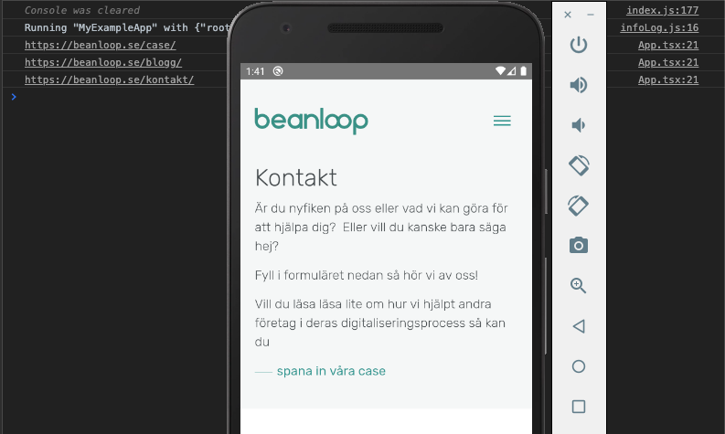

# Introduction

While React Native is a great way to build apps with the same major codebase for both iOS and Android, there may be cases where you need to access some native functionality that is only available through their API. React Native offers several native modules and views already integrated into their framework, but if you need some specific functionality you may need to write your own using either Swift+Objective-C for iOS, or Java/Kotlin for Android, and bridge it over to React Native yourself. I found the documentation for this to be somewhat lacking, which is why I've taken it upon myself to write a couple of guides on how to make and bridge a native view to use in React Native.

In a previous blog post, we covered how to bridge a native iOS WebView written in Swift to React Native, render it in our app, and pass data between the WebView and React Native. [Check that out here!](../rn-bridging-native-webview-ios) This time we are going to switch focus to Android and go through step-by-step how to do something similar for a WebView made in Java. This particular example implements a WebView, but the same practice could be applied to any type of native view.   

Instead of bridging the WebView by itself to use it as a [Native UI Component](https://reactnative.dev/docs/native-components-android), we will be bridging and launching a custom made activity which views the WebView. This way, we have all the control we would normally have while making native views, but still being able to use it in our React Native app. This could be useful for handling some custom native authentication flow, or some other collection of functionality which requires a series of native views.     

# Getting started

We will begin by creating a simple WebView in Java, which only displays a single URL, bridge, and render it in React Native. In later steps, we will make the WebView communicate back and forth with React Native.    

This guide assumes you already have at least a basic React Native project up and running. If you don't, check out the [official React Native docs](https://reactnative.dev/docs/getting-started) to get started.   

## Android app files

The first step is to create the Java files required for the WebView.   

- Open up your React Native android project and navigate to `app/src/main/java/com`. A lot of the work will be done here.

### Activity

Let's create the activity which, when launched, will handle viewing the WebView.   

*Note: Android apps are comprised of multiple activities, each one handling their own view(s) and user interactions when launched. In Android development, one activity generally implements one screen of the app. The first activity to start is always the main activity.*

- In our existing package folder, create a new activity file, right next to `MainActivity.java`. Give it a fitting name, in our case, we'll just name it `MyWebViewActivity.java`.    

- Go ahead and open the file you just created, and add the following code:   

```java
// MyWebViewActivity.java
package com.myexampleapp;

import android.os.Bundle;
import com.facebook.react.ReactActivity;

public class MyWebViewActivity extends ReactActivity {
    @Override
    protected void onCreate(Bundle savedInstanceState) {
        super.onCreate(savedInstanceState);
    }
}
```

As you may have noticed this activity doesn't really do anything at this point, besides allowing itself to be launched. We'll revisit this file later on in the guide, once we've created our actual WebView.

### AndroidManifest

We must also update the app's `AndroidManifest`. This XML-file, which is located in the app module's main source set, contains all sorts of important information about the android app, like specification on all of the app's components, which includes our newly created activity.

*Note: A source set is a way Android Studio groups a module's source code and resources to keep them organized. Only the main source set is mandatory, but other optional source sets may be created. React Native usually creates a debug source set, for example.*    

- Open up the `AndroidManifest.xml` file, located in the `app/src/main` folder.    

- You will most likely see all sorts of configurations in this file. Your project's `AndroidManifest` file might look slightly different than the example below, but the only thing you need to change is to add a new activity to the application node, right next to the preexisting `.MainActivity`.   

```xml
    <application
      android:name=".MainApplication"
      android:label="@string/app_name"
      android:icon="@mipmap/ic_launcher"
      android:roundIcon="@mipmap/ic_launcher_round"
      android:allowBackup="false"
      android:theme="@style/AppTheme">
      <activity
        android:name=".MainActivity"
        android:label="@string/app_name"
        android:configChanges="keyboard|keyboardHidden|orientation|screenSize"
        android:windowSoftInputMode="adjustPan"
      >
        <intent-filter>
            <action android:name="android.intent.action.MAIN" />
            <category android:name="android.intent.category.LAUNCHER" />
        </intent-filter>
      </activity>
      <!-- ADD THIS ACTIVITY -->
      <activity
        android:name=".MyWebViewActivity"
        android:label="@string/app_name"
        android:exported="false"
        android:configChanges="keyboard|keyboardHidden|orientation|screenSize"/>
      <!-- -->
      <activity android:name="com.facebook.react.devsupport.DevSettingsActivity" />
    </application>
```

Remember to use the same name you used as your activity class name.

*Note: Notice the `android:exported="false"` attribute. Setting an activity's exported attribute to false tells the activity that it can only be launched by other components/activities of the same application. If you want the activity to be started by other applications, omit the exported attribute, and instead specify an intent filter. For security reason, you must do one or the other.*

### WebView

- Next to your existing project package folder, create a new package folder for your WebView, and give it a fitting name. For this example, we will just call it `mywebview`. It's a good idea to be consistent with the naming of every file or folder involved with the WebView.    

*Note: In Java, package names are recommended to be written in lowercase.*

- Inside the newly created package folder, create the Java file for the WebView, called `MyWebView.java`.   

- Open up the `MyWebView.java` file and add the code for our very simple WebView:   

```java
// MyWebView.java
package com.mywebview;

import android.webkit.WebView;
import com.myexampleapp.MyWebViewActivity;
import android.webkit.WebSettings;

public class MyWebView extends WebView {

    public MyWebView(MyWebViewActivity activity) {
        super(activity);

        WebSettings webSettings = this.getSettings();
        webSettings.setJavaScriptEnabled(true); // optional

        this.loadUrl("https://beanloop.se");
    }
}
```

We now have a simple WebView which opens a single predefined URL that is set to be viewed using our created activity. Now we also need to tell our `MyWebViewActivity` to set the `MyWebView` as the activity's content view.   

- Open up the `MyWebViewActivity` file and update the activity:   

```java
// MyWebViewActivity.java
package com.myexampleapp;

import android.os.Bundle;
import com.facebook.react.ReactActivity;
import com.mywebview.MyWebView; // Add

public class MyWebViewActivity extends ReactActivity {
    @Override
    protected void onCreate(Bundle savedInstanceState) {
        super.onCreate(savedInstanceState);

        // Add
        final MyWebView myWebView = new MyWebView(this);
        setContentView(myWebView);
    }
}
```

Here we set our activity's content to our WebView. By default, this will take up the entirety of the screen. You can customize the view size in different ways, the simplest is setting the layout params for the `MyWebView`:   
`myWebView.setLayoutParams(new LayoutParams(width, height))`.

## Bridge as a native module to React Native

At this point, we have created our activity which, when started, will set its content view to `MyWebView`. If we were building our entire Android app in Java we would have all we need to render the WebView. It would be as simple as switching to the `MyWebViewActivity`. That is essentially what we need to do in React Native as well, however, the activity is currently inaccessible from the React Native side. We still need to bridge the activity over to React Native, so we can access it. To do that we need to export and expose a native module to React Native with a method that starts the activity. Let's go ahead and set up our *activity starter* native module.   

- In the same folder you created the `MyWebViewActivity` file, create a new Java file, and give it a name. We'll go with `MyWebViewActivityStarter.java`.  
You need the following code here:   

```java
package com.myexampleapp;

import com.facebook.react.bridge.ReactContextBaseJavaModule;
import com.facebook.react.bridge.ReactApplicationContext;
import com.facebook.react.bridge.ReactMethod;
import android.content.Intent;

public class MyWebViewActivityStarter extends ReactContextBaseJavaModule {
    MyWebViewActivityStarter(ReactApplicationContext reactContext) {
        super(reactContext);
    }
  
    @Override
    public String getName() {
        return "MyWebViewActivityStarter";
    }

    @ReactMethod
    void openMyWebView() {
        Intent intent = new Intent(getCurrentActivity(), MyWebViewActivity.class);
        intent.addFlags(Intent.FLAG_ACTIVITY_NEW_TASK);

        getCurrentActivity().startActivity(intent);
    }
}
```

A few things to note about this code.   
1. The class extends the `ReactContextBaseJavaModule`, which is the preferred way to make native modules to be used in React Native.
2. The class contains a public `getName` method, with a `@Override` annotation, that returns a string value. The string value will be the name the native module is exported as to React Native and is required.
3. The second method, `openMyWebview`, is the method that will start the `MyWebViewActivity`. It's `@ReactMethod` annotation tells the module to export that method to React Native. Every method/property that should be exported needs the `@ReactMethod` annotation.   
4. Finally, we instantiate an *intent* and send it to the activity. In Android development, an intent is essentially just a description of an action to be performed, containing information and metadata about the given action. Had we specified any intent-filters for our activity in our `AndroidManifest` file we would need to set the intent to that specific action the intent-filter allowed.   

Right now the only thing we do with our intent is to set a flag so our activity is started in a new task, but it will be more useful later on in the guide.  

- We now need to add our activity starter to our list of native modules made available to the React Native side. Therefore we need to make a package that does just that.   
In the same folder, create yet another file. Name it `MyWebViewActivityStarterReactPackage.java`, and fill it with the following code:   

```java
package com.myexampleapp;

import com.facebook.react.ReactPackage;
import com.facebook.react.bridge.NativeModule;
import com.facebook.react.bridge.ReactApplicationContext;
import com.facebook.react.uimanager.ViewManager;
import java.util.List;
import java.util.Collections;
import java.util.ArrayList;

class MyWebViewActivityStarterReactPackage implements ReactPackage {
    @Override
    public List<NativeModule> createNativeModules(ReactApplicationContext reactContext) {
        List<NativeModule> modules = new ArrayList<>();
        modules.add(new MyWebViewActivityStarter(reactContext));
        return modules;
    }

    @Override
    public List<ViewManager> createViewManagers(ReactApplicationContext reactContext) {
        return Collections.emptyList();
    }
}
```

This class is fairly standard. Inside the `createNativeModules` method which we've overridden, we import our activity starter, instantiate it, and add it to a list of modules.

- Finally open up the `MainApplication.java` file, which should be in the same folder.   

- Find the `getPackages` method, and add the `MyWebViewActivityStarterReactPackage` to the list of packages:   

```java
@Override
protected List<ReactPackage> getPackages() {
    @SuppressWarnings("UnnecessaryLocalVariable")
    List<ReactPackage> packages = new PackageList(this).getPackages();

    packages.add(new MyWebViewActivityStarterReactPackage()); // Add this line

    return packages;
}
```

We have now successfully bridged our WebView to React Native by setting it to the content view of an activity, that is made available to React Native by launching it in a native module, which is then placed in a package, which is in turn exported to React Native by adding it to their list of packages.  
Phew!    

If you're still with us after all that, we still need to try it out in our React Native app!

## React Native

```js
import React from "react"
import { NativeModules, Platform } from "react-native"

const App = () => {
    if (Platform.OS === "android") {
        NativeModules.MyWebViewActivityStarter.openMyWebView();
        return null;
    }

    // You will probably want to handle ios case here
}
```

All we need to is find our native module, which will have the same name as specified in the `getName` method and run the method we chose to export.

Start your application, and you should see the WebView in action!

  

# Communication between React Native and the Java WebView

So far we've made our native WebView in Java and we've managed to bridge it over to React Native and render it. Wunderbar! But as far as WebView's goes, it's rather limited in its usage. It can only view a single predefined URL and it can't return any data back to the React Native side.  

It would be nice if we could pass the URL we want to view from our React Native component.   
Let's do that now!  

## Passing data to Java class as arguments

Stay on the React Native side for now. We will give our `openMyWebView` method an argument, the URL the WebView should open.   

```js
if (Platform.OS === "android") {
    NativeModules.MyWebViewActivityStarter.openMyWebView("https://beanloop.se");
    return null;
}
```

We now need to intercept the new argument in our activity starter and pass it through all the way down to the WebView.  

- Open up the `MyWebViewActivityStarter.java` file, and edit the `openMyWebView` method to receive a new argument:     

```java
    @ReactMethod
    void openMyWebView(String url) {
        Intent intent = new Intent(getCurrentActivity(), MyWebViewActivity.class);
        intent.putExtra("url", url);
        intent.addFlags(Intent.FLAG_ACTIVITY_NEW_TASK);

        getCurrentActivity().startActivity(intent);
    }
```

We add the URL as an extra data item in the intent. This can then be extracted and used in the activity.

- Next up, open the `MyWebViewActivity`. We need to handle getting the URL from the intent:   

```java
package com.myexampleapp;

import android.os.Bundle;
import com.facebook.react.ReactActivity;
import com.mywebview.MyWebView;
import android.content.Intent; // Add

public class MyWebViewActivity extends ReactActivity {
    @Override
    protected void onCreate(Bundle savedInstanceState) {
        super.onCreate(savedInstanceState);

        // Add
        Intent intent = getIntent();
        String url = intent.getStringExtra("url");

        final MyWebView myWebView = new MyWebView(this, url);
        setContentView(myWebView);
    }
}
```

We get the URL from the intent and pass it as a second argument to `MyWebView`.

- Finally, in our `MyWebView` file, load the URL from the argument:  

```java
package com.mywebview;

import android.webkit.WebView;
import com.myexampleapp.MyWebViewActivity;
import android.webkit.WebSettings;

public class MyWebView extends WebView {

    public MyWebView(MyWebViewActivity activity, String url) {
        super(activity);

        WebSettings webSettings = this.getSettings();
        webSettings.setJavaScriptEnabled(true);

        this.loadUrl(url);
    }
}
```

Start the application and ensure it still works.  

## Passing data back from Java WebView

The final step of this guide will be to pass data from our Java WebView class back to React Native. For this example whenever the WebView redirects, it will send the new URL to React Native. 

- In our `MyWebView.java` file, add an additional class which will handle URL navigation, right underneath the `MyWebView` class:  

```java
package com.mywebview;

import android.webkit.WebView;
import android.webkit.WebViewClient; // add
import android.webkit.WebResourceRequest; // add
import com.myexampleapp.MyWebViewActivity;

public class MyWebView extends WebView {

    public MyWebView(MyWebViewActivity activity, String url) {
        super(activity);

        WebSettings webSettings = this.getSettings();
        webSettings.setJavaScriptEnabled(true);
        this.setWebViewClient(new CustomWebViewClient(activity)); // add
        this.loadUrl(url);
    }
}

// add
class CustomWebViewClient extends WebViewClient {
    MyWebViewActivity activity;

    public CustomWebViewClient(MyWebViewActivity ref) {
        this.activity = ref;
    }

    @Override
    public boolean shouldOverrideUrlLoading(WebView view, WebResourceRequest request) {
        activity.onRedirect(request.getUrl().toString());
        return false;
    }
}
```

We set `MyWebView`'s WebViewClient to our custom one to override the URL handling. The only thing we change is we send the new URL to the activity's `onRedirect` method whenever it changes. Right now this method does not exist yet in the activity. We need to add it.

- Open the `MyWebViewActivity` class and add a new public `onRedirect` method:  

```java
package com.myexampleapp;

import android.os.Bundle;
import com.facebook.react.ReactActivity;
import com.mywebview.MyWebView;
import android.content.Intent;
import com.facebook.react.ReactInstanceManager; // add
import com.facebook.react.modules.core.DeviceEventManagerModule; // add

public class MyWebViewActivity extends ReactActivity {
    @Override
    protected void onCreate(Bundle savedInstanceState) {
        super.onCreate(savedInstanceState);

        Intent intent = getIntent();
        String url = intent.getStringExtra("url");

        final MyWebView myWebView = new MyWebView(this, url);
        setContentView(myWebView);
    }

    // add
    public void onRedirect(String url) {
        getReactInstanceManager()
            .getCurrentReactContext()
            .getJSModule(DeviceEventManagerModule.RCTDeviceEventEmitter.class)
            .emit("onRedirect", url);
    }
}
```

The method receives the URL, and using the `DeviceEventManagerModule` module, we set up and emit a custom `onRedirect` event that returns the URL. If we listen to this event on the React Native side we will be able to receive it.

- Finally, back to our React Native code to intercept the event:   

```js
import React, { useEffect } from "react"
import { NativeModules, Platform, DeviceEventEmitter } from "react-native"

const App = () => {
    useEffect(() => {
        const onRedirect = (url) => {
            console.log(url);
        }

        DeviceEventEmitter.addListener("onRedirect", onRedirect);

        return () => {
            DeviceEventEmitter.removeListener("onRedirect", onRedirect);
        }
    }, []);

    if (Platform.OS === "android") {
        NativeModules.MyWebViewActivityStarter.openMyWebView("https://beanloop.se");
        return null;
    }

    // ...
}
```

Set up the event listener, and log the URL to the console on redirects.

See the updated WebView in action below:

  

# Done!

That's the end of this guide. If we navigate around a bit we'll see in the console that the new URLs sent through the `DeviceEventEmitter` are being logged successfully! While this may not be the most useful example in practice, it serves as an example of how you can launch an activity with custom native views from React Native, and pass data in between them. From here, you can do anything you would normally be able to do with activities and native views while being able to switch back to React Native at any time.  

# Read more

### Docs
[Native Modules](https://reactnative.dev/docs/native-modules-android)  
[Native UI Components](https://reactnative.dev/docs/native-components-android)  

### Useful posts

[Custom Native Modules](https://www.reactnative.guide/16-custom-native-modules/16.0-intro.html)  